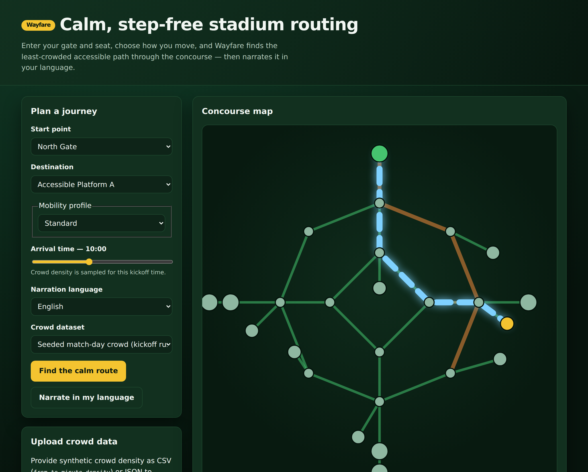
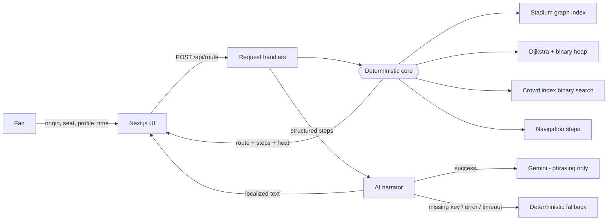

# Wayfare

**Calm, step-free stadium wayfinding for World Cup fans — routes that read the crowd, narrated in your language.**

[](./ci/ci.yml)
[](./vitest.config.ts)
[](./LICENSE)
[](https://nextjs.org)

> **Live demo:** _add your deployment URL here after `vercel --prod`._

Wayfare helps a fan who cares about **how** they move — a wheelchair user, a
parent with a pram, someone who finds dense crowds overwhelming — get from their
gate to their seat by the **least-crowded accessible path** through a packed
tournament stadium, and reads the directions back in their language.



---

## The persona and the problem

**Persona: the fan with access needs at a FIFA World Cup 2026 venue.**

On a match day a 60,000-seat bowl fills in minutes. Generic maps send everyone
down the same congested concourse and happily route a wheelchair user into a
staircase. The person who most needs a calm, step-free path is the one current
tools serve worst.

Wayfare solves exactly this, deeply, for one persona:

- It models the stadium as a graph of gates, concourses, ramps, lifts, stairs,
  escalators, seating, and exits.
- It computes the **lowest-cost feasible route** for the fan's mobility profile,
  weighting every segment by live crowd density so it steers around crushes.
- It narrates the result in the fan's language — and still works perfectly with
  no network and no API key.

## Approach: decisions are deterministic, the AI only phrases them

The heart of Wayfare is a pure, typed, exhaustively-tested engine. The language
model is a **narrator**, never a decision-maker. This is what makes the app
testable, secure against prompt injection, and reliable offline.



If you deleted every AI call, Wayfare would still compute and display correct,
accessible, crowd-aware routes. The model only makes the last mile friendlier.

## Technical gravity (the CS that stands on its own)

- **Crowd- and accessibility-aware routing** — Dijkstra's algorithm over a
  weighted graph, backed by a hand-written binary min-heap. `O((V + E) log V)`.
  Segment weight fuses distance, a per-profile mode multiplier (stairs are
  infeasible for a wheelchair), and a crowd penalty. See `src/core/routing.ts`
  and `src/core/heap.ts`.
- **Time-indexed crowd model** — per-segment samples are smoothed and queried by
  binary search (`bisect`) with linear interpolation: `O(log n)` per lookup
  instead of `O(n)`. See `src/core/crowd.ts`.
- **Constant-time lookups** — the graph is indexed once into hash maps for
  `O(1)` node and neighbour access. See `src/core/graph.ts`.
- **Deterministic turn geometry** — turn directions are derived from planar
  bearings, so narration can never invent a turn. See `src/core/geometry.ts`.

## Project structure

```
src/
  core/        Pure, typed engine (no I/O): graph, heap, routing, crowd,
               steps, geometry, ingest/validation, seeded data
  ai/          Isolated LLM narrator: client, resilience, sanitize, fallback
  server/      Handlers, in-memory store, security headers, rate limit, envelopes
  app/         Next.js App Router: pages, layout, API routes, middleware
  components/  Presentational, accessible React components
  lib/         Browser API client, labels, UI types
tests/         Unit, edge-case, branch, and component/a11y suites (Vitest)
e2e/           Playwright end-to-end + axe accessibility scan
```

## Problem-alignment map

| Domain need (Smart Stadiums)         | Feature in Wayfare                                | Where it lives                                       |
| ------------------------------------ | ------------------------------------------------- | ---------------------------------------------------- |
| Move fans efficiently through crowds | Crowd-weighted shortest-path routing              | `src/core/routing.ts`, `src/core/crowd.ts`           |
| Serve fans with access needs         | Per-profile feasibility (step-free, wheelchair)   | `src/core/constants.ts`, `src/core/routing.ts`       |
| Operate with no live venue API       | Synthetic crowd upload (CSV/JSON) + seeded data   | `src/core/ingest.ts`, `src/app/api/ingest`           |
| A global, multilingual audience      | Localized narration incl. right-to-left languages | `src/ai/narrator.ts`, `src/server/config.ts`         |
| Real-time crowd awareness            | Time-sliced crowd heat overlay on the map         | `src/app/api/route`, `src/components/StadiumMap.tsx` |
| Genuine, functional GenAI            | LLM narration with deterministic fallback         | `src/ai/`, `src/app/api/narrate`                     |

## Quality → evidence map

Every claim below is reproducible with one command; run them and read the output.

| Dimension     | Where it lives                                           | Verify                                                |
| ------------- | -------------------------------------------------------- | ----------------------------------------------------- |
| Code quality  | Small typed modules; complexity/type/format gates        | `npm run lint` · `npm run typecheck` · `npm run dup`  |
| Security      | Headers + CSP, input validation, rate limit, secret scan | `npm test` · `npm audit --omit=dev` · CodeQL workflow |
| Efficiency    | Heap-backed Dijkstra, binary search, memoised indexes    | Big-O docstrings in `src/core/*`                      |
| Testing       | 100% line + branch coverage, mutation testing            | `npm run test:cov` · `npm run mutation`               |
| Accessibility | Landmarks, ARIA live, RTL, `axe` assertions              | `npm run e2e` · `tests/components`                    |
| Problem align | One persona solved end-to-end                            | `npm run dev`, then plan a route                      |

### Measured on this codebase

- **134 tests pass**; **100% line and branch coverage** on the core, AI, and
  server layers (1,496/1,496 statements, 322/322 branches, 111/111 functions).
- **90.3% mutation score** on the routing core (Stryker; CI breaks below 90%).
- **0** type errors, **0** lint findings (`--max-warnings=0`), **0%** code
  duplication, **0** circular dependencies, **0** unused files/exports/deps.
- **0** known vulnerabilities in production dependencies (`npm audit --omit=dev`).

## Getting started

```bash
npm ci             # install exact dependencies
npm run dev        # start the app on http://localhost:3000
```

The app is fully functional with **no configuration**. To enable live model
narration, copy `.env.example` to `.env.local` and set `GEMINI_API_KEY`;
without it, Wayfare narrates with its deterministic fallback.

### Test and verify

```bash
npm run verify     # typecheck + lint + format + duplication + circular + coverage
npm run mutation   # mutation testing on the routing core
npm run e2e        # Playwright smoke test + axe accessibility scan
```

### Continuous integration

The full quality gate is defined in [`ci/ci.yml`](./ci/ci.yml) (lint, types,
format, duplication, dead-code, coverage, mutation, dependency audit, secret
scan, build) and [`ci/codeql.yml`](./ci/codeql.yml) (static analysis). To run it
on GitHub Actions, move both files into `.github/workflows/` (kept out of that
folder here only because the automation token used to publish this repo lacks
the `workflow` scope). Every command the gate runs is reproducible locally with
the scripts above.

### Deploy (Vercel)

```bash
npm i -g vercel
vercel            # link the project (first run)
vercel --prod     # deploy; copy the printed URL into the demo link above
```

Set `GEMINI_API_KEY` (and optionally `GEMINI_MODEL`) as Vercel environment
variables to enable model narration in production.

## Using synthetic crowd data

Because no live venue feed is provided, upload your own via the **Upload crowd
data** panel or `POST /api/ingest`:

```csv
from,to,minute,density
gate-n,lc-n,600,0.82
lc-n,lc-ne,600,0.90
```

`from`/`to` are node ids, `minute` is the minute of the match day (0–1439), and
`density` is crowd density from 0 (empty) to 1 (standstill). JSON with the same
fields is also accepted.

## Assumptions

- The stadium graph and crowd feed are **synthetic but realistic**; the
  architecture is production-shaped and the data is seeded (per the brief).
- Crowd density is a normalised `0–1` value; a real deployment would map sensor
  counts to this range per segment.
- The demo runs at micro-scale (a 25-node bowl); the algorithms are the same at
  stadium scale.
- Narration uses Google Gemini when a key is present; the app is designed to be
  fully usable without one.
- Distances are in metres and walking speeds are per-profile estimates used only
  for the time estimate, not for routing feasibility.
